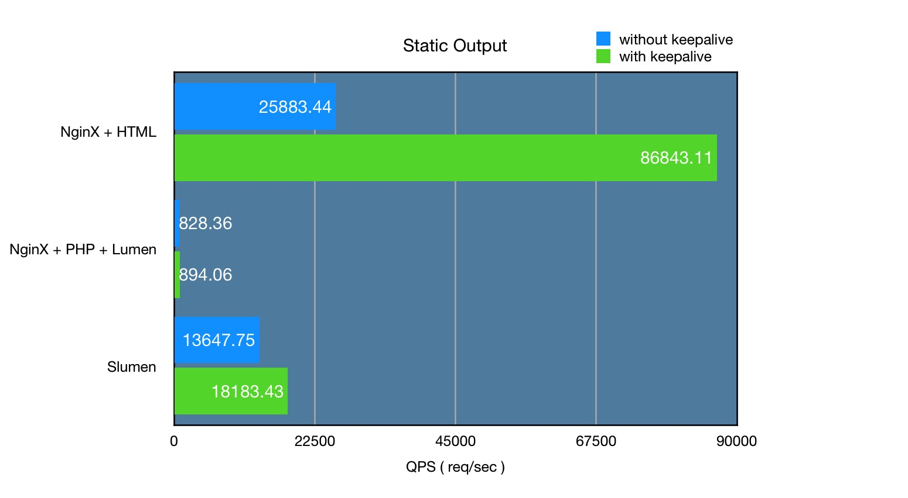
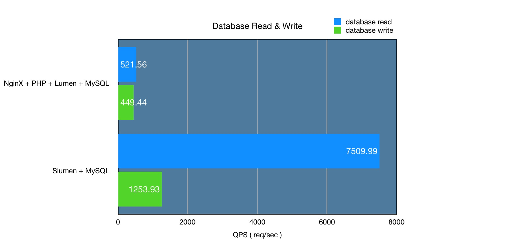

## 压力测试

### 测试环境
* 操作系统：ubuntu16.04x64
* 内存：虚拟4GB
* CPU：虚拟4核3.0GHz
* NginX：v1.10.3
* PHP：v7.0.22
* Swoole：v1.9.2
* MySQL：v5.7.9
* ApcacheBench: v2.3

### 静态输出

#### 测试对象

* NginX(4worker) + HTML
* NginX(4worker) + PHP-FPM(static200children) + Lumen
* Slumen(4worker)

#### 测试命令
2000并发500000请求，不使用HTTP Keepalive，与使用HTTP Keepalive：
```bash
$ ab -c 200 -n 500000 http://127.0.0.1:9080/
$ ab -c 200 -n 500000 -k http://127.0.0.1:9080/
```
#### 测试结果



### 数据库读写

#### 测试对象

* NginX(4worker) + PHP-FPM(static200children) + Lumen + MySQL
* Slumen(4worker) + MySQL

#### 测试命令
使用HTTP Keepalive，200并发50000请求数据库读，200并发50000请求数据库写：
```bash
$ ab -c 200 -n 50000 -k http://127.0.0.1:9080/db_read
$ ab -c 200 -n 50000 -k http://127.0.0.1:9080/db_write
```
#### 测试结果



